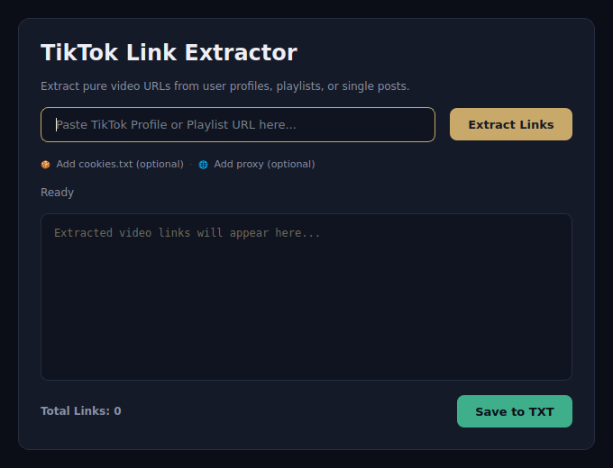

# TikTok Link Extractor

A lightweight desktop tool for extracting TikTok video URLs from profiles, playlists, or individual posts.



## Features

- Extract video links without downloading media
- Supports profiles, playlists, and single posts
- Optional `cookies.txt` support
- Optional proxy configuration
- Background extraction keeps the UI responsive
- Simple, modern PySide6 interface

## Requirements

- Python 3.10+
- PySide6
- yt-dlp

## Installation

```bash
pip install -r requirements.txt
```

## Run

```bash
python main.py
```

## Notes

For private or restricted content, provide a valid Netscape-format `cookies.txt` file when required.

---

**Built with Python, PySide6, and yt-dlp.**
